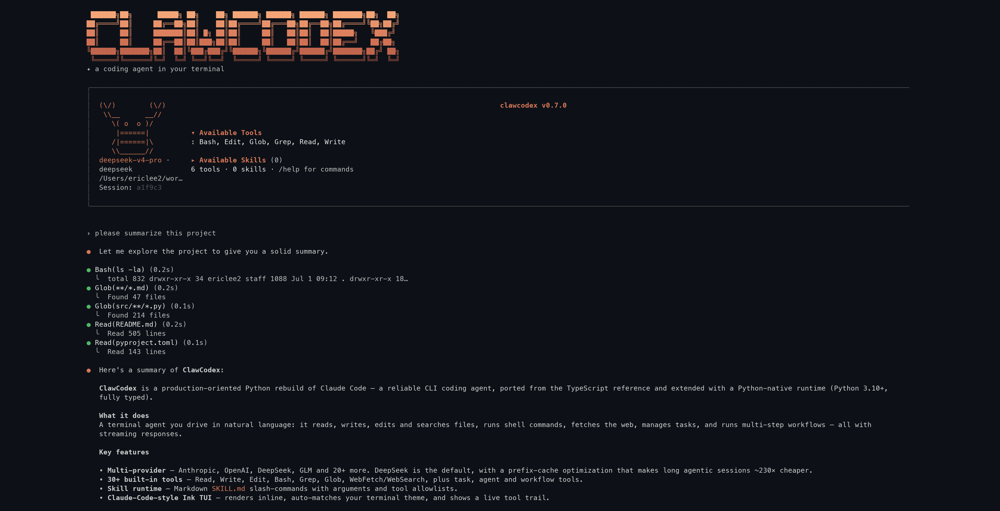
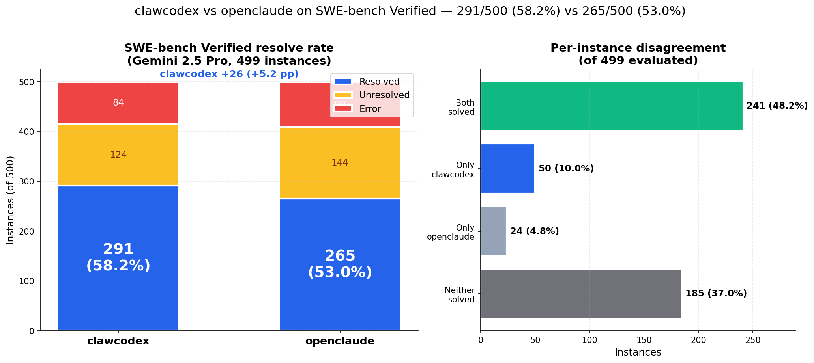

<div align="center">

[English](../../README.md) | **中文** | [Français](README_FR.md) | [Русский](README_RU.md) | [हिन्दी](README_HI.md) | [العربية](README_AR.md) | [Português](README_PT.md)

# ClawCodex

**面向生产使用的 Claude Code Python 重写版 —— 真实架构、可靠的 CLI Agent**

*从 TypeScript 参考实现移植而来，并扩展了 Python 原生运行时*

***

[](https://github.com/agentforce314/clawcodex/stargazers)
[](https://github.com/agentforce314/clawcodex/network/members)
[](https://opensource.org/licenses/MIT)
[](https://www.python.org/downloads/)


**🔥 活跃开发中 • 每周更新新功能 🔥**



</div>

***

## ⚡ 快速安装

```bash
git clone https://github.com/agentforce314/clawcodex.git
cd clawcodex
python3 -m venv .venv && source .venv/bin/activate   # Python 3.10+
pip install -r requirements.txt

python -m src.cli login   # 配置写入 ~/.clawcodex/config.json

python -m src.cli --dangerously-skip-permissions   # 启动 REPL
```

配置文件保存在 `~/.clawcodex/config.json`。最小示例：

```json
{
  "default_provider": "zai",
  "providers": {
    "zai": {
      "api_key": "xxx-xxx",
      "base_url": "https://api.z.ai/api/coding/paas/v4",
      "default_model": "glm-5.2"
    }
  }
}
```

`session`、`settings` 和 `env` 块均为可选——省略时会使用合理的默认值。完整结构见 [配置](#配置)。

***

## 📰 新闻

- **2026-06-16：** **Z.ai GLM-5.2 支持（#343）** —— 新增 `zai` provider，对接 Z.ai 的 OpenAI 兼容 GLM 编程套餐（`https://api.z.ai/api/coding/paas/v4`），提供 `GLM-5.1` 与 `GLM-5.2` 预览版；GLM-5.2 的编码能力可比肩 Claude Opus 4.7。首个用 GLM-5.2 端到端生成的应用——一个 [2026 世界杯介绍页](../../demos/wc26-intro/index.html)（动效首屏 + 实时倒计时、三个主办国、16 座球场、赛制说明与破纪录数据）。
- **2026-06-11：** **代码库统计** —— Python 文件总数：1,093 个；Python 代码总行数：**233,520 行**（高于 2026-05-29 的 213,777 行；新增约 1.97 万行，主要来自交互式命令系统批次、动态 workflow 引擎 + `/deep-research`，以及 Tavily 网络工具链更新）。
- **2026-06-10 至 2026-06-11：** **动态 workflow 引擎 + `/deep-research`（#262–#264、#266–#271）** —— Python workflow 引擎核心（`agent()`/`parallel()`/`pipeline()`/`phase()`、运行日志、断点恢复）完成端到端接线：Workflow 工具、`/workflows` TUI 对话框 + 状态栏指示、按 agent 重试、worktree 隔离、结果投递，以及注册为斜杠命令的内置 `/deep-research` 研究工作流。可靠性方面：LLM 读取超时统一应用到所有 openai 兼容 provider（#269），并行 agent 不再在事件循环上串行执行（#270），deep-research 的 synthesize 步骤禁用工具、避免报告撰写 agent 陷入循环（#271）。后续修复：workflow max-turns 上限修复（#272）、deep-research verdict 枚举修复（#273）、带阶段进度与各 agent 统计的 `/workflows` 实时监控（#287）。
- **2026-06-10：** **Web 工具链更新（#265）** —— 用基于 Tavily 的 WebSearch 取代已失效的 DuckDuckGo 抓取，并新增基于配置文件的密钥存储；WebFetch 重写为确定性的 markdown/text/html 提取（借鉴 opencode）。
- **2026-05-30 至 2026-06-09：** **交互式命令系统对齐（#230–#261）** —— 交互式移植 `/theme`、`/effort`、`/model`、`/logo`、`/mcp`、`/tasks`、`/diff`、`/export`、`/output-style`、`/statusline`、`/release-notes`、`/copy`、`/vim`、`/memory`、`/stickers` 与 `/rename`，构建于新的 prompt-text 原语与交互式命令桥之上；技能注册与模型工具暴露接线；会话持久化生产者（`SessionPersister` + agent-bridge 接线）；外加扩展思考支持（#249）与模型错误吞噬修复（#250）。
- **2026-05-29：** **代码库统计** —— Python 文件总数：977 个；Python 代码总行数：**213,777 行**（高于 2026-05-21 的 183,768 行；新增约 3 万行，来自远程桥接对齐移植（阶段 0–18）、`/buddy` 虚拟伙伴子系统与 CLI 传输层）。
- **2026-05-29：** **远程桥接对齐 + CLI 传输（#200–#226）** —— 完成远程控制桥接阶段 0–18 的完整移植：bridge API 客户端、子 CLI 会话运行器、免环境变量的 v2 编排器、多会话守护进程、worktree 启动、原地重连、带崩溃恢复的常驻模式、JWT 刷新，以及 v1 `WebSocketTransport` / `SerialBatchEventUploader` 写路径与混合分发。另含 CLI 传输工厂、合并式 worker 状态上传器与 `RemoteIO` 桥（#226）；新增 `/buddy` 虚拟伙伴命令——孵化 / 抚摸 / 状态 / 静音（#225）。
- **2026-05-21：** **代码库统计** —— Python 文件总数：890 个；Python 代码总行数：**183,768 行**（高于 2026-05-16 的 177,428 行；因 `src/tool_system/agent_loop.py` 合并进 `src/query/query.py`，文件数净减 4 个）。
- **2026-05-21：** **`/advisor` 省 token 编码模式（#181–#193）** —— 让低成本 worker 模型（`haiku-4-5`，每 Mtok $1/$5）与高成本 reviewer（`opus-4-7`，$5/$25）搭档，仅在关键决策点咨询后者；典型会话比纯 opus 便宜约 6 倍。支持显式 `<provider>:<model>` 语法、跨 provider 路由（例如经 litellm 使用 `deepseek/deepseek-v4-pro` worker + `claude-opus-4-7` advisor），并在状态栏实时显示 worker/advisor 的 token 数与美元成本。
- **2026-05-16：** **代码库统计** —— Python 文件总数：894 个；Python 代码总行数：**177,428 行**（高于 2026-05-14 的 167,034 行；两天新增约 1.04 万行，主要是 ESC 取消加固与图像处理对齐）。

📚 更早的条目已移至完整的 **[News 归档](../NEWS.md)**。

***

## 🎯 为什么是 ClawCodex？

**ClawCodex** 是一个**面向生产使用的 Claude Code Python 重写版**：从**真实的 TypeScript 架构**移植而来，并以**可用的 CLI Agent** 形式交付，而不只是一份源码镜像。

- **真实 Agent Runtime** —— 工具调用循环、流式 REPL、会话历史与多轮执行
- **高保真移植** —— 保留 Claude Code 的原始架构，同时做符合 Python 风格的实现
- **适合二次开发** —— 可读的 Python 代码、丰富的测试，以及基于 Markdown 的技能扩展
- **多 LLM 提供商** —— 相对上游最大的进展：Claude Code 仅围绕 Claude 系列模型构建，而 ClawCodex 致力于接入**所有主流 LLM 提供商**，让你为 agentic 编程选择最**灵活**、最**具性价比**的技术栈

**一个真正可跑的 Claude Code 风格 Python 终端工作流：流式回答、调用工具、抓取上下文，并通过 skills 扩展行为。**

**🚀 立即试用！Fork 它、修改它、让它成为你的！欢迎提交 Pull Request！**

***

## 🏆 SWE-bench Verified —— 相同模型下 `clawcodex` 超越 `openclaude`



在完整的 **SWE-bench Verified** 数据集（499 个实例，公开的 agent 编码榜单）上，两个 agent 均由 **Gemini 2.5 Pro** 驱动，运行在我们的标准化评测框架中：

| Agent | 已解决 | 未解决 | 错误 |
|---|---:|---:|---:|
| **clawcodex** | **291 / 499（58.2%）** | 124 | 84 |
| openclaude | 265 / 499（53.0%） | 144 | 90 |

- ✅ **两者都解决**：241 &nbsp;&nbsp; 🟢 **仅 clawcodex 解决**：50 &nbsp;&nbsp; 🔵 **仅 openclaude 解决**：24 &nbsp;&nbsp; ❌ **均未解决**：184

本地复现 —— 完整流程（累积分批、`--predict-workers N`、`--capture-traces`）见 [`eval/README.md`](../../eval/README.md)。

***

## ⭐ Star 历史

[在 star-history.com 查看 Star 历史图表](https://www.star-history.com/?repos=agentforce314%2Fclawcodex&type=date&legend=top-left)

## ✨ 特性

### 流式 Agent 体验

```text
>>> /stream on
>>> 解释 tests/test_agent_loop.py
[流式回答中...]
• Read (tests/test_agent_loop.py) running...
  ↳ lines 1-180
>>> /render-last
```

- 直接回答支持真实 API 流式输出，带工具的 agent loop 也具备更完整的流式体验
- 内置 `/stream` 开关用于实时输出，`/render-last` 可按需把上一条回答重新渲染为 Markdown
- 专门为终端演示优化：一边看回答流出，一边看到工具调用，并保留稳定回退路径

### 可编程 Skill Runtime

```md
---
description: 用类比 + 图示解释代码
allowed-tools:
  - Read
  - Grep
  - Glob
arguments: [path]
---

请解释 $path 的实现：先给一个类比，再画一个结构示意图。
```

- 基于 `SKILL.md` 的 Markdown 斜杠命令
- 支持项目级技能、用户级技能、命名参数替换与工具限制

### 多提供商支持

ClawCodex 的核心优势是**多提供商支持**：Claude Code 以 **Claude** 系列模型为目标，而我们希望在同一套 Agent 运行时之上支持**所有主流 LLM 提供商**——你可以自由切换厂商、区域与价位，而不必放弃工具、技能与编码闭环。正是这种灵活性，让 agentic 编程在规模化使用时真正可行。

```python
providers = ["anthropic", "openai", "zai", "minimax", "openrouter", "deepseek"]  # OpenAI 兼容与 GLM API；可继续扩展
```

### 交互式 REPL（默认）与 Textual TUI（可选）

**默认**交互界面为 **prompt_toolkit + Rich** 行内 REPL（对话记录保留在终端滚动区，外加感知工具状态的状态行）。需要时，使用 **`clawcodex --tui`** 或 REPL 内的 **`/tui`** 斜杠命令进入 **Textual** 全屏界面。

```text
>>> 你好！
Assistant: 嗨！我是 ClawCodex，一个 Python 重实现...

>>> /help          # 显示命令
>>> /tools         # 列出已注册工具
>>> /tui           # 切换到 Textual TUI
>>> /stream on     # 流式渲染开关
>>> /save          # 保存会话
>>> Tab            # 自动补全
>>> /explain-code qsort.py   # 运行 SKILL.md 技能（或 /skill …）

# 多行输入：Shift+Enter、Meta/Alt+Enter，或 `\` 后 Enter 换行；单独 Enter 提交。
```

### 完整的 CLI

```bash
clawcodex                       # 行内 REPL（默认）
clawcodex --tui                 # Textual TUI
clawcodex --stream              # 开启实时渲染的 REPL
clawcodex login                 # 交互式配置 API key
clawcodex config                # 查看 ~/.clawcodex/config.json 中的配置
clawcodex --version             # 版本信息

# 非交互 / 脚本化（管道、CI、自动化 agent）
clawcodex -p "总结 src/cli.py"
clawcodex -p "Hello" --output-format json
clawcodex -p --output-format stream-json --input-format stream-json < events.ndjson

# 单次运行覆盖配置
clawcodex --provider anthropic --model claude-sonnet-4-6 -p "Hi"
clawcodex --max-turns 10 --allowed-tools Read,Grep -p "查找 TODO"

# 权限控制（REPL、TUI 与 -p 均生效）
clawcodex --permission-mode plan                       # plan / acceptEdits / dontAsk
clawcodex --dangerously-skip-permissions -p "ls"       # 跳过所有权限检查
clawcodex --allow-dangerously-skip-permissions         # 允许之后通过 /permission-mode 切换为 bypass
```

> **`--dangerously-skip-permissions`** 会在整个会话期间禁用所有工具权限检查。
> 仅建议在无互联网访问的沙箱容器/虚拟机中使用。当进程以 root/sudo
> 运行时该参数会被拒绝，除非设置了 `IS_SANDBOX=1` 或 `CLAUDE_CODE_BUBBLEWRAP=1`。

***

## 📊 状态

| 组件    | 状态     | 数量     |
| ----- | ------ | ------ |
| REPL 命令 | ✅ 完成   | 内置命令 + `/tools`、`/stream`、`/context`、`/compact`、技能等 |
| 工具系统 | ✅ 完成   | 30+ 工具 |
| 自动化测试 | ✅ 已覆盖  | 工具、agent loop、providers、parity、REPL、认证等 |
| 文档    | ✅ 完成   | 指南、多语言 README、[FEATURE_LIST.md](../../FEATURE_LIST.md) |

### 核心系统

| 系统 | 状态 | 描述 |
|------|------|------|
| CLI 入口 | ✅ | `clawcodex`、`login`、`config`、`-p` / `--print`、`--tui`、`--stream`、`--version` |
| 交互式 REPL | ✅ | 默认行内 REPL；可选 Textual TUI；历史、Tab 补全、多行输入 |
| 多提供商支持 | ✅ | Anthropic、OpenAI、智谱 GLM、Minimax、OpenRouter、DeepSeek——含 Anthropic→OpenAI 的 image / document 块转换，适配具备视觉能力的 OpenAI 兼容后端 |
| 会话持久化 | ✅ | 本地保存/加载会话 |
| Agent Loop | ✅ | 工具调用循环；支持流式与无头模式 |
| Skill 系统 | ✅ | 基于 SKILL.md 的斜杠技能：参数与工具白名单 |
| 取消 / 中止 | ✅ | ESC 可在约 50ms 内中止进行中的 Bash、Grep/Glob 以及所有 provider 的流式 HTTP；子 agent 拥有隔离的 `AbortController`；`Bash` 的 `tool_result` 区分超时与 ESC 中止 |
| 图像处理 | ✅ | 与 TS 对齐的 Read 管线（魔数嗅探、按 API 限制缩放/压缩）；`@image.png` @-提及内联为 `ImageBlock`；`BaseProvider._prepare_messages` 中调用 API 前的 base64 大小校验；二进制 @-提及（PDF/zip/docx/…）转为 Read 工具提示而非乱码 |
| 上下文构建 | 🟡 | workspace / git / `CLAUDE.md` 注入；更丰富的摘要与 memory 仍在演进 |
| 权限系统 | 🟡 | 框架与检查逻辑已有；全面集成进行中 |
| MCP | 🟡 | MCP 相关工具与接线已有；协议层/运行时仍在完善 |

### 工具系统（已实现 30+ 工具）

| 类别 | 工具 | 状态 |
|------|------|------|
| 文件操作 | Read, Write, Edit, Glob, Grep | ✅ 完成 |
| 系统 | Bash 执行 | ✅ 完成 |
| 网络 | WebFetch, WebSearch | ✅ 完成 |
| 交互 | AskUserQuestion, SendMessage | ✅ 完成 |
| 任务管理 | TodoWrite, TaskManager, TaskStop | ✅ 完成 |
| Agent 工具 | Agent, Brief, Team | ✅ 完成 |
| 配置 | Config, PlanMode, Cron | ✅ 完成 |
| MCP | MCP 工具与资源 | 🟡 工具已接线；完整 client/runtime 仍在演进 |
| 其他 | LSP, Worktree, Skill, ToolSearch | ✅ 完成 |

### 路线图进度

- ✅ **阶段 0**：可安装、可运行的 CLI
- ✅ **阶段 1**：Claude Code 核心 MVP 体验
- ✅ **阶段 2**：真实工具调用闭环
- 🟡 **阶段 3**：上下文深度、权限集成、类 `/resume` 的恢复能力（进行中）
- 🟡 **阶段 4**：MCP 运行时深化、插件与可扩展性（工具已有，平台能力持续推进）
- ⏳ **阶段 5**：Python 原生差异化特性

**详细功能状态和 PR 指南请查看 [FEATURE_LIST.md](../../FEATURE_LIST.md)。**

## 🚀 快速开始

### 安装

```bash
git clone https://github.com/agentforce314/clawcodex.git
cd clawcodex

# 创建虚拟环境（推荐使用 uv）
uv venv --python 3.11
source .venv/bin/activate

# 安装包与 console 入口（推荐）
uv pip install -e ".[dev]"

# 或：先装依赖再 editable 安装
# uv pip install -r requirements.txt && uv pip install -e .
```

### 配置

#### 方式 1：交互式（推荐）

```bash
clawcodex login
# 或: python -m src.cli login
```

这个流程会：

1. 让你选择 provider：anthropic / openai / zai / minimax / openrouter / deepseek
2. 让你输入该 provider 的 API key
3. 可选：保存自定义 base URL
4. 可选：保存默认 model
5. 将该 provider 设为默认

配置文件保存在 `~/.clawcodex/config.json`。示例结构：

```json
{
  "default_provider": "anthropic",
  "providers": {
    "anthropic": {
      "api_key": "your-api-key",
      "base_url": "https://api.anthropic.com",
      "default_model": "claude-sonnet-4-6"
    },
    "openai": {
      "api_key": "your-api-key",
      "base_url": "https://api.openai.com/v1",
      "default_model": "gpt-5.4"
    },
    "zai": {
      "api_key": "your-api-key",
      "base_url": "https://api.z.ai/api/coding/paas/v4",
      "default_model": "glm-5.2"
    },
    "minimax": {
      "api_key": "your-api-key",
      "base_url": "https://api.minimaxi.com/anthropic",
      "default_model": "MiniMax-M2.7"
    },
    "openrouter": {
      "api_key": "your-api-key",
      "base_url": "https://openrouter.ai/api/v1",
      "default_model": "deepseek/deepseek-v4-pro"
    },
    "deepseek": {
      "api_key": "your-api-key",
      "base_url": "https://api.deepseek.com",
      "default_model": "deepseek-v4-pro"
    }
  },
  "session": {
    "auto_save": true,
    "max_history": 100
  },
  "settings": {
    "advisor_model": "claude-sonnet-4-6",
    "advisor_client_mode": false,
    "advisor_provider": "openai"
  },
  "env": {
    "TAVILY_API_KEY": "tvly-YOUR-TAVILY-API-KEY"
  }
}
```

- **`session`** —— REPL 会话持久化：`auto_save` 自动保存每个会话；`max_history` 限制保留的对话轮数。
- **`settings`** —— 后台辅助功能所用的 advisor 模型（`advisor_provider` / `advisor_model`，以及控制是否经由客户端路由的 `advisor_client_mode`）。
- **`env`** —— 启动时注入的密钥与环境变量（例如用于 Web 搜索的 `TAVILY_API_KEY`）。通过 `clawcodex config` 管理；这里的键会被导出到进程环境，但不会覆盖你在 shell 中已设置的值。

### 运行

```bash
clawcodex                  # 启动行内 REPL（等同于 python -m src.cli）
clawcodex --help           # 全部参数：--tui、-p、--provider、--model 等
```

**就这样！** 配置密钥后即可使用 CLI 或 REPL。

***

## 💡 使用

### REPL 命令

| 命令 | 描述 |
| --- | --- |
| `/` | 显示命令与技能 |
| `/help` | 帮助 |
| `/tools` | 列出已注册工具名 |
| `/tool <name> <json>` | 以 JSON 输入直接调用工具 |
| `/stream` | 流式渲染：`/stream on`、`off` 或 `toggle` |
| `/render-last` | 将上一条助手回复重新渲染为 Markdown |
| `/save`、`/load <id>` | 保存或加载会话 |
| `/clear` | 清空对话（亦支持 `/reset`、`/new`） |
| `/tui` | 进入 Textual TUI |
| `/skill` | 技能启动流程 |
| `/context` | 工作区 / 提示上下文（若可用） |
| `/compact` | 压缩或清空对话（不可用时回退为清空） |
| `/exit`、`/quit`、`/q` | 退出 |

### Skills（技能 / 斜杠命令）

技能是存放在 `.clawcodex/skills` 下的 Markdown 斜杠命令。每个技能对应一个目录，并且文件名固定为 `SKILL.md`。

**1）创建项目技能**

创建：

```text
<project-root>/.clawcodex/skills/<skill-name>/SKILL.md
```

示例：

```md
---
description: 用类比 + 图示解释代码
when_to_use: 在解释代码如何工作时使用
allowed-tools:
  - Read
  - Grep
  - Glob
arguments: [path]
---

请解释 $path 的实现：先给一个类比，再画一个结构示意图。
```

**2）在 REPL 中使用**

```text
❯ /
❯ /<skill-name> <args>
```

示例：

```text
❯ /explain-code qsort.py
```

**补充说明**

- 用户级技能：`~/.clawcodex/skills/<skill-name>/SKILL.md`
- 工具限制：`allowed-tools` 用于限制技能允许调用的工具集合
- 参数替换：支持 `$ARGUMENTS`、`$0`、`$1`、以及命名参数（例如来自 `arguments` 的 `$path`）
- 占位符写法：请使用 `$path`，不要写成 `${path}`


***

## 🎨 演示

**[`demos/`](../../demos/) 目录下的每个应用都由 ClawCodex 自身端到端生成** —— 用的正是你刚安装的这个 CLI、同一个 agent loop、同一套工具。零人工修改 🙂

| 演示 | 技术栈 | 描述 |
| ---- | ----- | ----------- |
| [`demos/crm-app`](../../demos/crm-app) | React 18 + Vite + Vitest | 迷你 CRM：联系人、商机、仪表盘与完整测试套件 |
| [`demos/linkedin-app`](../../demos/linkedin-app) | React 18 + Vite + React Router | LinkedIn 风格信息流：个人主页、人脉、职位、私信 |
| [`demos/minecraft-app`](../../demos/minecraft-app) | React + three.js + @react-three/fiber | 浏览器体素沙盒：地形、挖掘、HUD 与玩家控制 |
| [`demos/wc26-intro`](../../demos/wc26-intro) | 纯静态 HTML/CSS/JS | 2026 世界杯介绍页——动效首屏、实时倒计时、主办国、16 座球场、赛制与破纪录数据；用全新的 Z.ai **GLM-5.2** 模型端到端生成 |

```bash
cd demos/crm-app   # 或 linkedin-app / minecraft-app
npm install
npm run dev        # vite 开发服务器
```

`demos/wc26-intro` 是单文件静态页面——直接在浏览器中打开 [`demos/wc26-intro/index.html`](../../demos/wc26-intro/index.html) 即可。

想看看它是怎么做到的？在任意空目录里打开 ClawCodex，让它构建点什么——上面这些都是这样生成的。

***

## 🎓 为什么选择 ClawCodex？

### 基于真实源码

- **不是克隆** —— 从真实的 TypeScript 实现移植而来
- **架构保真** —— 保持经过验证的设计模式
- **持续改进** —— 更好的错误处理、更多测试、更清晰的代码

### 原生 Python

- **类型提示** —— 完整的类型注解
- **现代 Python** —— 使用 3.10+ 特性
- **符合习惯** —— 干净的 Python 风格代码

### 以用户为中心

- **3 步设置** —— 克隆、配置（`clawcodex login`）、运行（`clawcodex`）
- **交互式配置** —— 一个流程内完成 provider、Base URL 与默认模型
- **行内或 TUI** —— 默认终端原生 REPL；可选 Textual UI
- **可脚本化** —— `-p` / JSON / NDJSON 便于自动化
- **会话持久化** —— 保存与恢复对话

***

## 架构

关于六大核心抽象（query loop、tools、tasks、两级 state、memory、hooks），以及从用户输入到模型输出的黄金路径，请见
[`docs/ARCHITECTURE.md`](../ARCHITECTURE.md)。推荐新贡献者从这里入手。

原版 Claude Code 架构的参考资料位于
`claude-code-from-source/book/ch01-architecture.md`；逐章的移植差距分析与重构计划存放在
`my-docs/` 下。

***


## 📦 项目结构

```text
clawcodex/
├── src/
│   ├── cli.py              # CLI 入口（控制台命令 clawcodex）
│   ├── entrypoints/        # 无头（-p）与 TUI 启动
│   ├── repl/               # 行内 REPL（prompt_toolkit + Rich）
│   ├── tui/                # Textual UI（--tui、/tui）
│   ├── providers/          # Anthropic、OpenAI、GLM、Minimax、OpenRouter、DeepSeek
│   ├── agent/              # 对话、会话、提示词
│   ├── tool_system/        # Agent loop、工具与 schema
│   ├── skills/             # SKILL.md 加载与 Skill 工具
│   ├── services/           # MCP、compact、IDE 桥、工具执行等
│   ├── context_system/     # workspace / git / CLAUDE.md 上下文
│   ├── permissions/        # 权限模式与 bash 解析
│   ├── hooks/              # Hook 类型与执行辅助
│   └── command_system/     # 斜杠命令与参数替换
├── typescript/             # 参考 / 对等源码（运行 Python CLI 非必需）
├── tests/                  # pytest 测试套件
├── docs/                   # 指南、多语言 README、重构笔记
├── .clawcodex/skills/      # 项目级技能（可选）
├── FEATURE_LIST.md         # 能力矩阵与路线图
└── pyproject.toml          # 包元数据与 clawcodex 入口
```

***


## 🤝 贡献

**我们欢迎贡献！**

```bash
# 快速开发设置
pip install -e .[dev]
python -m pytest tests/ -v
```

查看 [CONTRIBUTING.md](../../CONTRIBUTING.md) 了解指南。

***

## 📖 文档

- **[SETUP_GUIDE.md](../guide/SETUP_GUIDE.md)** —— 详细安装说明
- **[CONTRIBUTING.md](../../CONTRIBUTING.md)** —— 开发指南
- **[TESTING.md](../guide/TESTING.md)** —— 测试指南
- **[CHANGELOG.md](../../CHANGELOG.md)** —— 版本历史

***

## ⚡ 性能

- **启动时间**：< 1 秒
- **内存占用**：< 50MB
- **响应**：回合式助手输出，支持 Rich Markdown 渲染

***

## 🔒 安全

✅ **基础本地安全实践**

- Git 中无敏感数据
- API 密钥在配置中已做混淆
- `.env` 文件被忽略
- 适合本地开发工作流

***

## 📄 许可证

MIT 许可证 —— 查看 [LICENSE](../../LICENSE)

***

## 🙏 致谢

- 基于 Claude Code TypeScript 源码
- 独立的教育项目
- 未隶属于 Anthropic

***

<div align="center">

### 🌟 支持我们

如果你觉得这个项目有用，请给个 **star** ⭐！

**由 ClawCodex 团队用 ❤️ 打造**

[⬆ 回到顶部](#clawcodex)

</div>

***

***
